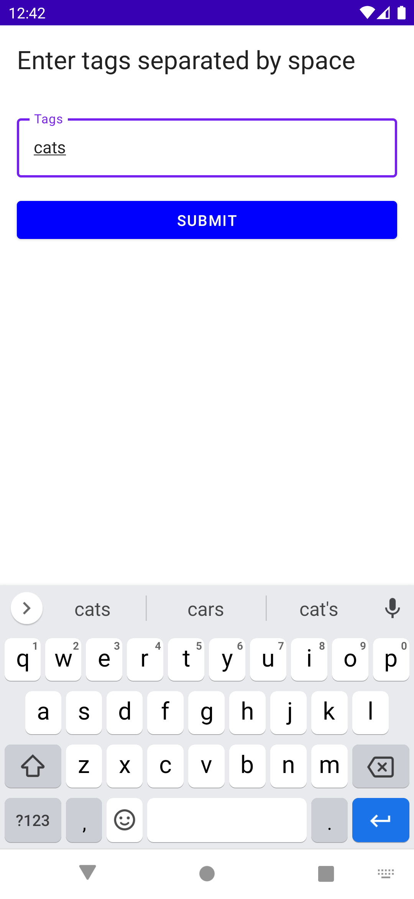
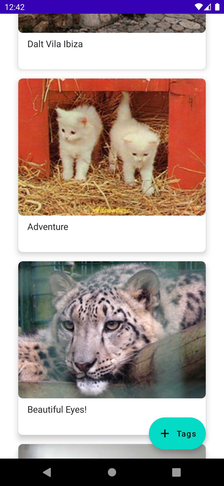
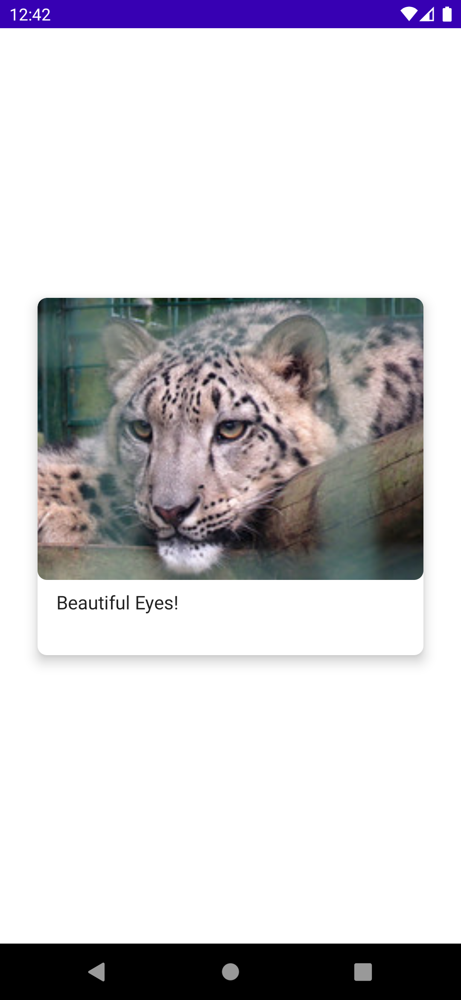

## CODING TEST ASSIGNMENT

### API
Flickr has some public accessible feeds: https://www.flickr.com/services/feeds/  

One feed provides a list of public photos. See more at  
https://www.flickr.com/services/feeds/docs/photos_public/  

You do not need to create an API key. To get a JSON response use this format:  
https://api.flickr.com/services/feeds/photos_public.gne?format=json&nojsoncallback=1  

### TASK
- Create a simple Android application that uses this API. 
- For the Design you can express your own creativity.
- Let the user enter some tags he/she wants to search for and return a list of these images in a list or grid.
- Show the title of every image.
- On image tap open a full screen view of the image.

### SCOPE
- **Language**: Kotlin
- **Modularization**: None
- **Gradle**: Kts, Version catalog
- **DI**: Hilt
- **Presentation**: Compose, ViewModel, Coroutines
- **Network**: KTor
- **Images Download**: Coil

### SCREENSHOTS

